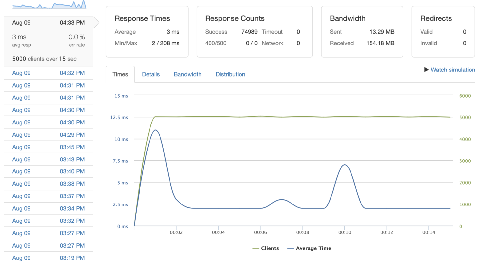

# reviewsAPI

The reviewsAPI project is a system design experiment implementing Redis, PostgreSQL, Node, and hosted on AWS, focusing on back-end optimization.  The project is the back-end portion of Project Greenfield, an e-commerce site.  The reviewsAPI swaps out the sample data for a more robust data set, over 5million products, each with reviews that can contain photos, characteristics for the product, and much more.  Below is test of 5,000 RPS to the most popular 10,000 product ids using 2 EC2s.

Links to stress tests comparing Redis Cache vs PosteSQL cache
https://imgur.com/a/0ZuL52I
